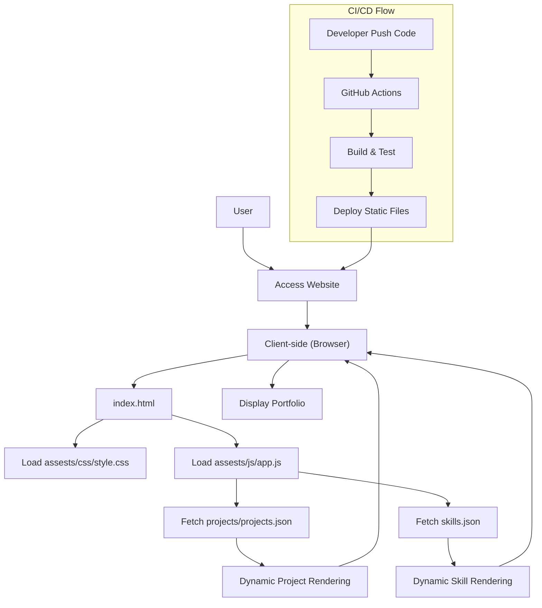

# 🚀 Portfolio Website

<p align="center"></p>

## Short Description
Ignite your professional presence with this dynamic and highly customizable personal portfolio website. Engineered for developers, designers, and creatives, this project provides a stunning, responsive, and interactive platform to showcase your skills, projects, and professional journey. It features a modern design, seamless navigation, and automated deployment capabilities to ensure your online persona is always up-to-date and impactful.

## ✨ Key Features
*   **Immersive Project Showcases:** Dedicated sections to highlight your best work with detailed descriptions and visual assets, powered by `projects.json` for easy updates.
*   **Comprehensive Skill Matrix:** Dynamically display your technical proficiencies, languages, and tools using `skills.json` for a clear overview of your capabilities.
*   **Professional Experience Timeline:** A structured section to outline your career path and contributions, providing context to your growth.
*   **Integrated Resume Download:** Easily provide potential employers with a direct link to your professional resume (`assests/resume.pdf`).
*   **Elegant & Responsive Design:** Crafted with HTML5, CSS3, and JavaScript, ensuring a flawless experience across all devices and screen sizes.
*   **Interactive UI Elements:** Engage visitors with visual flair through libraries like Particles.js and custom JavaScript animations, creating a memorable user experience.
*   **Automated CI/CD Workflow:** Streamlined deployment process using GitHub Actions (`.github/workflows/ci-cd.yml`) for continuous integration and delivery.
*   **Custom 404 Page:** A branded and user-friendly error page (`404.html`) to guide users back to relevant content.
*   **Optimized Performance:** Preloaders (`assests/images/preloader.gif`, `assests/images/loader.gif`) and efficient asset loading for a smooth browsing experience.

## Who is this for?
This project is ideal for:
*   **Software Developers & Engineers:** Showcase coding projects, technical expertise, and career progression.
*   **UI/UX Designers:** Present design portfolios, case studies, and visual creations.
*   **Freelancers & Consultants:** Establish an online presence to attract clients and display services.
*   **Students & Graduates:** Create a compelling digital resume to kickstart their careers.
*   **Anyone:** Looking for a modern and engaging way to represent their professional profile online.

## Technology Stack & Architecture
This portfolio is built on a robust, front-end focused stack designed for performance and maintainability:

*   **Frontend:** HTML5, CSS3, JavaScript
*   **Styling:** Custom CSS with a responsive design approach.
*   **Interactivity:** Vanilla JavaScript, enhanced with `particles.min.js` for visual effects.
*   **Data Management:** JSON files (`skills.json`, `projects/projects.json`) for dynamic content loading, making updates straightforward.
*   **Version Control:** Git
*   **Continuous Integration/Deployment (CI/CD):** GitHub Actions

## 📊 Architecture & Database Schema
This project leverages a client-side architecture, where static content and data are served directly to the user's browser, eliminating the need for a traditional backend database. Dynamic sections are powered by local JSON files.



## ⚡ Quick Start Guide
Get your personalized portfolio up and running in minutes!

1.  **Clone the Repository:**
    ```bash
    git clone https://github.com/cineverse107/portfolio_website.git
    cd portfolio_website
    ```
2.  **Open in Browser:**
    Simply open the `index.html` file in your preferred web browser.
    ```bash
    # For Linux/macOS
    open index.html
    # For Windows
    start index.html
    ```
3.  **Customize Your Content:**
    *   Edit `index.html` to update personal details.
    *   Modify `projects/projects.json` to showcase your projects.
    *   Update `skills.json` with your technical abilities.
    *   Replace `assests/resume.pdf` with your own resume.
    *   Customize styles in `assests/css/style.css`.

## 📜 License
This project is licensed under the MIT License. See the `LICENSE` file for more details.